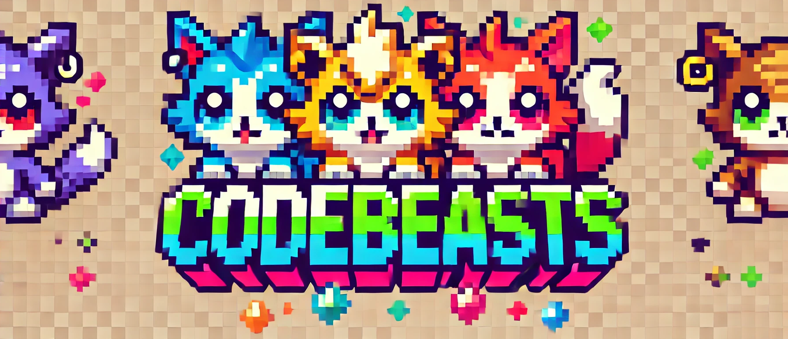

# CodeBeast Generator

<p align="center">
  
</p>

CodeBeast Generator is a web application that creates unique pixel art mascots based on GitHub profiles. It uses AI to analyze GitHub data and generate personalized, retro-style animal mascots.

## Features

- Generates unique pixel art mascots from GitHub handles
- Uses AI to analyze GitHub profiles and create personalized descriptions
- Creates high-quality pixel art using DALL-E 3
- Real-time status updates during generation
- Download and social sharing options

## Tech Stack

- **Frontend**: HTML, CSS, JavaScript
- **Backend**: Python, Flask
- **AI/ML**: 
  - OpenAI's DALL-E 3 for image generation
  - Langflow for GitHub data processing
- **Other Tools**:
  - NProgress for loading indicators
  - python-dotenv for configuration

## Setup

1. Clone the repository:

```bash
git clone https://github.com/yourusername/codebeast-generator.git
cd codebeast-generator
```

2. Create and activate a virtual environment:

```bash
python -m venv env
source env/bin/activate  # On Windows: env\Scripts\activate
```

3. Install dependencies:

```bash
pip install -r requirements.txt
```

4. Create a `.env` file in the project root with your configuration:

```env
# API Configuration
LANGFLOW_BASE_URL=http://localhost:7860
LANGFLOW_FLOW_ID=your-flow-id
OPENAI_API_KEY=your-openai-key

# Flask Configuration
FLASK_DEBUG=True
FLASK_ENV=development
```

5. Create required directories:

```bash
mkdir -p static/temp
```

6. Run the application:

```bash
python app.py
```

The application will be available at `http://localhost:5000`

## Usage

1. Enter a GitHub handle in the input field
2. Click "Generate" or press Enter
3. Wait for the AI to analyze the profile and generate a mascot
4. Download or share your generated mascot

## Project Structure

```
codebeast-generator/
├── app.py              # Main Flask application
├── dall_e.py          # DALL-E integration module
├── static/
│   ├── css/
│   │   └── style.css  # Application styles
│   ├── js/
│   │   └── main.js    # Frontend JavaScript
│   ├── images/        # Static images
│   └── temp/          # Generated images
├── templates/
│   └── index.html     # Main application template
├── .env               # Environment configuration
└── requirements.txt   # Python dependencies
```

## Contributing

1. Fork the repository
2. Create a feature branch: `git checkout -b feature-name`
3. Commit your changes: `git commit -am 'Add feature'`
4. Push to the branch: `git push origin feature-name`
5. Submit a pull request

## License

[MIT License](LICENSE)

## Acknowledgments

- OpenAI for DALL-E 3 API
- Langflow for GitHub data processing
- All contributors and users of the application
